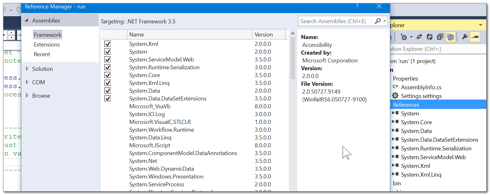
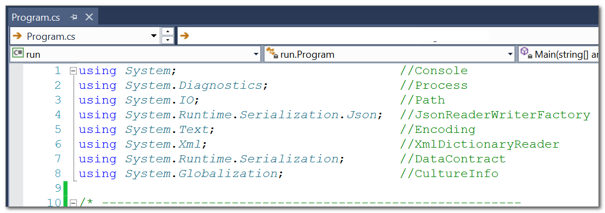
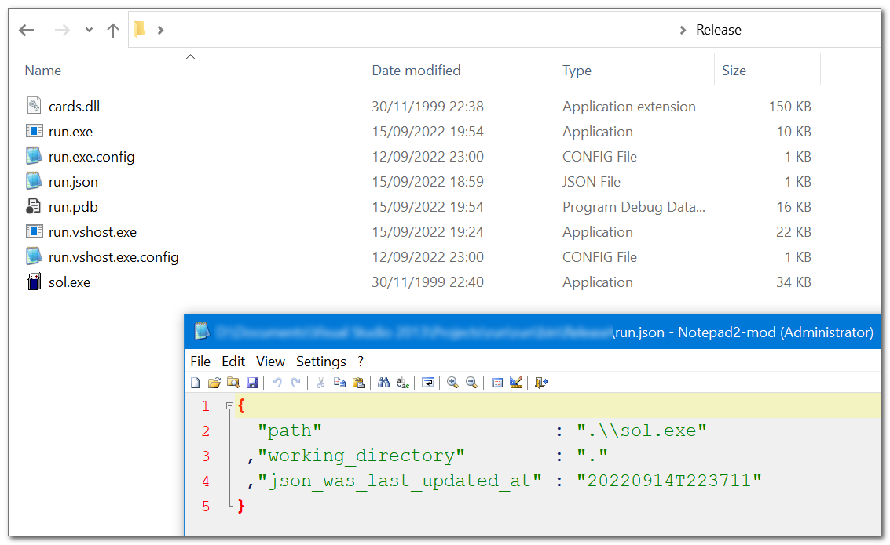
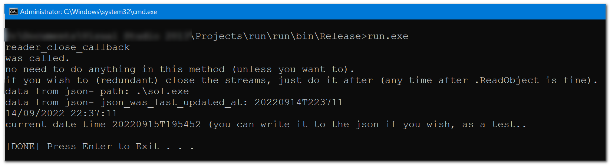

<h1>

C#-JSON example  
with just .Net framework  

</h1>

<a href="https://paypal.me/%65%31%61%64%6B%61%72%61%6B%30/%35%55%53%44" title="show your support">♥</a>

 

  

  

  

  

 

 

a ready to use,  
quick and (very) dirty example  
YOU CAN EASILY UNDERSTAND.  

not using Json.NET/Newtonsoft.Json.dll,  
no embedding dll tricks either,  
you'll get a plain single exe at the end. works even with .net 2.0  
(I'm using 3.5 though, which is the minimal for build-time app.manifest embedding).  

example has EVERYTHING in one file: `program.cs`  
(no classes, no scope code-blocks, very little error handling - so you won't get too distracted).  

just to be clear,  
it is ALL managed code,  
no string manipulation or any crap like that.  

<h3>

this is what you want.  

</h3>

I b3g your pardon for the..  
snake_case,  
comma-first,  
spacing,  
and other style preferences.  
oh and the $h!t ton of notes and comments.  

for example-sake the project has a `copy` command of a demo json, and old-(familiar) card game  
(which the dll belongs to, it isn't a program dependency).  

everything I wrote is UnLicensed  
(that game IS NOT though..).  

no support,  
no releases.  
enjoy..
